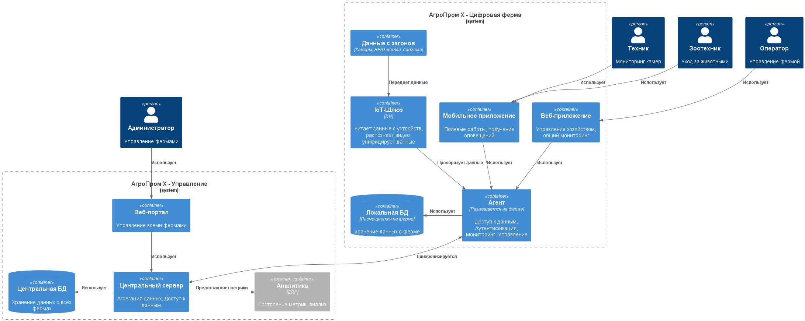
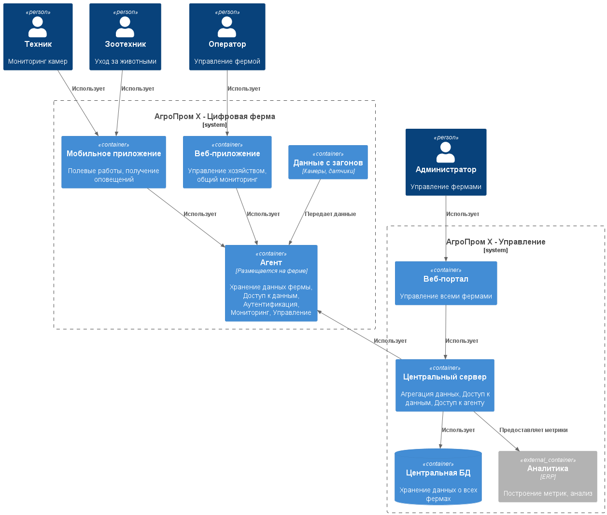

### **Название задачи:** Проект решения задачи
### **Автор:** Екатерина
### **Дата:** 10.08.2025

### **Функциональные требования**

|**№**|**Действующие лица или системы**|**Use Case**|**Описание**|
| :-: | :- | :- | :- |
| **UC01** | Животные, Система мониторинга стада | Фиксация поведения стада | Необходимо распознавать и фиксировать признаки беспокойного поведения животных, драк, задавливания |
| **UC01.1** | Животные, Система мониторинга стада | Фиксация поведения стада: Драки | Необходимо распознавать и фиксировать признаки драк |
| **UC01.2** | Животные, Система мониторинга стада | Фиксация поведения стада: Задавливание | Необходимо распознавать и фиксировать признаки задавливания поросят в стаде |
| **UC02** | Животные, Система мониторинга животного | Оценка состояния индивидуальной особи | Необходимо оценивать состояние **индивидуальной** особи, выявлять: болезнь, гибель, беспокойство и т.д. (NFR07) |
| **UC02.1** | Животные, Система мониторинга животного | Оценка состояния индивидуальной особи: болезни | Необходимо выявлять болезненность животного |
| **UC02.2** | Животные, Система мониторинга животного | Оценка состояния индивидуальной особи: беспокойство | Необходимо выявлять беспокойство животного |
| **UC02.3** | Животные, Система мониторинга животного | Оценка состояния индивидуальной особи: гибель | Необходимо выявлять гибель животного |
| **UC03** | Животные, Система мониторинга стада | Подсчет поголовья | Система должна уметь подсчитывать все поголовье животных на ферме |
| **UC04** | Кормушки, Склад, Система мониторинга еды | Мониторинг еды | Необходимо отслеживать запасы еды и прогнозировать расход (NFR08) и уведомлять о снижении запасов на пульт мониторинга фермы (NFR03) |
| **UC05** | Система фильтрации воды, Система мониторинга воды | Мониторинг воды | Необходимо отслеживать состояние за системой фильтрации воды (NFR08) и уведомлять о проблемах на пульт мониторинга фермы (NFR03) |
| **UC06** | Камеры, Система мониторинга камер | Мониторинг камер | Необходимо отслеживать работоспособность камер и качество картинки (NFR08) и уведомлять о проблемах на пульт мониторинга фермы (NFR03) |
| **UC07** | Оператор, Зоотехник, Техник, Агент | Авторизация и аутентификация | Для доступа в систему необходимо иметь аккаунт сотрудника с назначенными ролями (NFR06) |
| **UC08** | Система мониторинга, Оператор, Зоотехник, Техник | Оповещать оператора о нештатных ситуациях на ферме | Уведомление о всех нештатных ситуациях на ферме должно приходить на пульт мониторинга фермы (NFR03, NFR06) |
| **UC09** | Агент | Наличие АПИ | Необходимо предоставлять универсальный АПИ для работы как Веб, так и мобильного приложений (NFR06) |
| **UC10** | Агент, Центральный сервер | Синхронизация с центральным сервером | Все данные о состоянии фермы и событиях должны быть синхронизированы с центральным сервером (NFR04, NFR05) |
| **UC11** | Центральный сервер | Метрики | Система должна поддерживать возможность предоставления и экспорта различных метрик для последующего анализа и обработки |

### **Нефункциональные требования**

|**№**|**Требование**|
| :-: | :- |
| **NFR01** | Обеспечивать **SLA >99.95%** |
| **NFR02** | Система видеоаналитики должна **реагировать в режиме реального времени** |
| **NFR03** | **Уведомления о нештатной ситуации** должны появляться **< 5 секунд** |
| **NFR04** | **Задержка между агентом и сервером** должна быть **< 10 минут** (не учитывая ситуации полного отсутствия связи с центральным сервером) |
| **NFR05** | Принцип "Сервер-Агенты", **не должно быть ограничений по количеству агентов** |
| **NFR06** | Агент должен работать **в режиме отсутствия интернета** |
| **NFR07** | Функционал системы должен расширяться без значимых изменений |
| **NFR08** | Необходимо поддерживать работы с устройствами разных производителей |

### **Решение**

Функционал системы основывается вокруг мониторинга животных с помощью камер и RFID-меток.
Выявлением всех необходимых параметров занимается ИИ-модель, которая будет предоставлена партнерами.

Вся платформа разделяется на две крупные части: агент и сервер. Агент размещается на ферме и связывается со всем сопутствующим оборудованием и техникой на ферме.

Дополнительный слой в виде IoT-платформы позволит работать с устройствами различных производителей и подготавливать данные для агента.

Агент хранит все данные рядом с собой, чтобы система оставалась работоспособной даже в условиях отсутствия интернета и связи с центральным сервером.

Мобильное приложение и веб-портал общается с агентом на ферме, предоставляя удобный доступ к ежедневным задачам персоналу.

Агент синхронизирует данные с центральным сервером, который находится в дата центре и агрегирует всю информацию для дальнейшей аналитики и предоставления данных администраторам.

### **Альтернативы**

В качестве альтернативы можно отказаться от использования RFID-меток и полагаться только на машинное зрение и ИИ. Это уменьшит стоимость внедрения и начальной подготовки фермы к запуску.
Но данный подход не позволит точно отслеживать перемещения и конкретные действия животных.

Для экономии времени и быстрого запуска MVP можно отказаться от использования отдельной прослойки IoT-шлюза и преобразовывать данные внутри агента, что усложнит в будущем добавление дополнительных устройств других производителей, т.к. потребуется изменений в основной системе.

С целью экономии времени разработки можно допустить отсутствие синхронизации агента с центрального сервером, что будет усложнять доступ к данным, если на ферме будет плохой интернет или если сеть отсутствует. Так же такой подход создаст излишнюю нагрузку на сервера агента, которые сложно/невозможно масштабировать. Это влечет за собой и усложнение системы аналитики.

**Недостатки, ограничения, риски**

**Нейронные сети:**
- Часто нейронные сети путают тень животного с самим животным — для MVP не критично.
- Проблемы с освещением — камеры должны уметь снимать и в ночное время суток.
- Трекинг животных достаточно сложен, так как особи очень похожи.
- Готовую нейросетевую модель предоставят партнёры.

**Инфраструктура:**
- На ферме нестабильный WiFi, поэтому нужно продумать альтернативные каналы связи.
- Покрытие камерами всей площади — нужно по максимуму убрать слепые зоны либо воспользоваться камерами типа «рыбий глаз», но это снизит качество в силу выпуклости линзы.
- На каждой ферме допустимо использовать один центральный сервер и необходимый набор edge-устройств.
- Требуется чипирование всех особей RFID-метками

