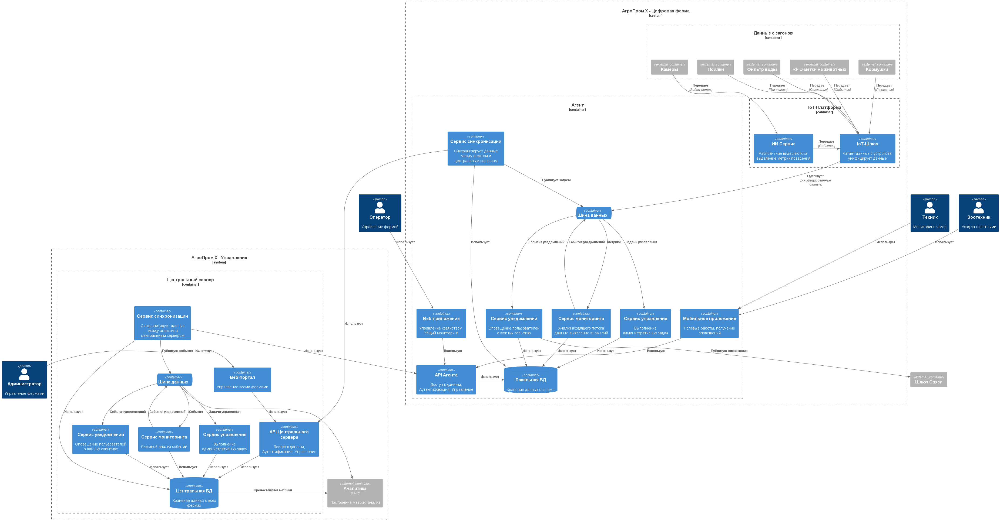

### **Название задачи:** Проработка высокоуровневого видения решений
### **Автор:** Екатерина
### **Дата:** 14.08.2025

### **Функциональные требования**

|**№**|**Действующие лица или системы**|**Use Case**|**Описание**|
| :-: | :- | :- | :- |
| **UC01** | Животные, Система мониторинга стада | Фиксация поведения стада | Необходимо распознавать и фиксировать признаки беспокойного поведения животных, драк, задавливания |
| **UC01.1** | Животные, Система мониторинга стада | Фиксация поведения стада: Драки | Необходимо распознавать и фиксировать признаки драк |
| **UC01.2** | Животные, Система мониторинга стада | Фиксация поведения стада: Задавливание | Необходимо распознавать и фиксировать признаки задавливания поросят в стаде |
| **UC02** | Животные, Система мониторинга животного | Оценка состояния индивидуальной особи | Необходимо оценивать состояние **индивидуальной** особи, выявлять: болезнь, гибель, беспокойство и т.д. (NFR07) |
| **UC02.1** | Животные, Система мониторинга животного | Оценка состояния индивидуальной особи: болезни | Необходимо выявлять болезненность животного |
| **UC02.2** | Животные, Система мониторинга животного | Оценка состояния индивидуальной особи: беспокойство | Необходимо выявлять беспокойство животного |
| **UC02.3** | Животные, Система мониторинга животного | Оценка состояния индивидуальной особи: гибель | Необходимо выявлять гибель животного |
| **UC03** | Животные, Система мониторинга стада | Подсчет поголовья | Система должна уметь подсчитывать все поголовье животных на ферме |
| **UC04** | Кормушки, Склад, Система мониторинга еды | Мониторинг еды | Необходимо отслеживать запасы еды и прогнозировать расход (NFR08) и уведомлять о снижении запасов на пульт мониторинга фермы (NFR03) |
| **UC05** | Система фильтрации воды, Система мониторинга воды | Мониторинг воды | Необходимо отслеживать состояние за системой фильтрации воды (NFR08) и уведомлять о проблемах на пульт мониторинга фермы (NFR03) |
| **UC06** | Камеры, Система мониторинга камер | Мониторинг камер | Необходимо отслеживать работоспособность камер и качество картинки (NFR08) и уведомлять о проблемах на пульт мониторинга фермы (NFR03) |
| **UC07** | Оператор, Зоотехник, Техник, Агент | Авторизация и аутентификация | Для доступа в систему необходимо иметь аккаунт сотрудника с назначенными ролями (NFR06) |
| **UC08** | Система мониторинга, Оператор, Зоотехник, Техник | Оповещать оператора о нештатных ситуациях на ферме | Уведомление о всех нештатных ситуациях на ферме должно приходить на пульт мониторинга фермы (NFR03, NFR06) |
| **UC09** | Агент | Наличие АПИ | Необходимо предоставлять универсальный АПИ для работы как Веб, так и мобильного приложений (NFR06) |
| **UC10** | Агент, Центральный сервер | Синхронизация с центральным сервером | Все данные о состоянии фермы и событиях должны быть синхронизированы с центральным сервером (NFR04, NFR05) |
| **UC11** | Центральный сервер | Метрики | Система должна поддерживать возможность предоставления и экспорта различных метрик для последующего анализа и обработки |

### **Нефункциональные требования**

|**№**|**Требование**|
| :-: | :- |
| **NFR01** | Обеспечивать **SLA >99.95%** |
| **NFR02** | Система видеоаналитики должна **реагировать в режиме реального времени** |
| **NFR03** | **Уведомления о нештатной ситуации** должны появляться **< 5 секунд** |
| **NFR04** | **Задержка между агентом и сервером** должна быть **< 10 минут** (не учитывая ситуации полного отсутствия связи с центральным сервером) |
| **NFR05** | Принцип "Сервер-Агенты", **не должно быть ограничений по количеству агентов** |
| **NFR06** | Агент должен работать **в режиме отсутствия интернета** |
| **NFR07** | Функционал системы должен расширяться без значимых изменений |
| **NFR08** | Необходимо поддерживать работы с устройствами разных производителей |

### **Решение**

#### Система фермы

Размещается на ферме.

**Локальная БД:**
Отвечает за хранение данных всей фермы, размещается на ферме и обеспечивает офлайн-доступ к данным.
В качестве основного движка предлагается использовать **MySQL**, простое решение, которое будет легко поддерживать со стороны фермы. Необходимо выполнить расчет по объему хранимых значений в среднем на фермах, возможно при преодолении определенного порога по количеству собираемых метрик и животных на ферме, необходимо переходить на **Postgress**.

**Шина данных:**
Отвечает за общую коммуникацию всех микросервисов на ферме. Предлагается использовать **RabbitMQ** как легковестное решение, которые при необходимости можно масштабировать при превышении нагрузки. Если расчеты нагрузки в зависимости от количества животных и метрик будут показывать высокие требования, необходимо использовать **Kafka** в качестве основного решения на ферме, чтобы обеспечить достаточную скорость обработки сообщений.

**ИИ Сервис:**
Получает видео-поток данных с камер, размещенных на ферме и пропускает его через модель машинного обучения, предоставленную партнерами.
Все полученные параметры отправляются на IoT-Шлюз для дальнейшей упаковки в унифицированный формат и отправки в шину данных.
Передача в IoT-шлюз должна происходить по средством асинхронного API вызова, для упаковки события и последующей отправки метрики в шину данных. Возможно стоит рассмотреть отказ от этого взаимодействия и формировать унифицированные метрики для шины данных сразу на стороне ИИ сервиса. Но это приводит к размыванию ответственности по упаковке метрик.

**IoT-Шлюз:**
Отвечает за сбор данных с различных IoT устройств по протоколам и стандартам, которые они поддерживают.
Унифицирует формат данных под общий стандарт, разработанный для агента и публикует данные с устройств в виде метрик данных в шину данных агента.

**Сервис мониторинга:**
Отвечает за анализ всего входящего потока метрик и событий от устройств и выявление аномальных ситуаций.
Если распознается какое-либо событие, оно отправляется отдельным событие обратно в шину данных агента.
Сервис использует базу данных для чтения конфигураций и параметров, которые необходимы при анализе потока.

**Сервис уведомлений:**
Читает события, которые были зарегистрированы сервисом мониторинга, сохраняет их отдельно в базу данных для истории и публикует сообщение через внешний канал связи.
В качестве внешнего канала связи может быть выбрана технология push-уведомлений или смс.

**API Агента:**
Отвечает за авторизацию, доступ к данным и управление фермой.
Все команды управления публикуются в шину данных агента для дальнейшей обработки.
Использует локальную базу данных для обращения к данным даже в режиме отсутствия интернета.

**Сервис управления:**
Отвечает за выполнения задач управления конкретной фермой. Читает их порядок задач из опубликованной очереди сообщений и выполняет операции.

**Сервис синхронизации:**
Отвечает за переодический опрос (раз в 10 минут) центрального сервера для обновления данных, которые не дошли в момент отсутствия связи на ферме.
Так же публикует свежие данные с фермы.
Коммуникация между центральным сервером и фермой должна происходить посредством **gRPC** протокола для обеспечения возможности потоковой передачи накопившихся данных, особенно в режиме, когда интернет на ферме отсутствовал некоторое время.

**Веб-приложение:**
Интерфейс доступа к данным с помощью веб-браузера, который связывается с АПИ с помощью локальной или глобальной сети в зависимости от доступных возможностей.
Коммуницирует с АПИ посредством **RestAPI** протокола.

**Мобильное приложение:**
Используется сотрудниками для совершения своих рабочих задач и быстрого доступа к информации о ферме, животных и оперативного оповещения в случае экстренных ситуаций.
Коммуницирует с АПИ посредством **RestAPI** протокола.

#### Система управления

Размещается в дата-центре основной инфрастуктуры.

**Центральная БД:**
Отвечает за хранение данных всех ферм. Предлагается использовать архитектуру распределенных баз: уникальные данные каждой фермы размещаются в собственных изолированных БД; управляющие данные (например, пользователи, права доступа, информация о списках ферм и т.д.) размещаются в отдельной БД.
Рекомендуется использовать Postgress, т.к. необходимо работать с большим количеством данных, которые будут поступать из различных источников (ферм).

**Шина данных:**
Отвечает за общую коммуникацию всех микросервисов. Рекомендуется использовать **Kafka** в качестве основного решения, т.к. здесь происходит агрегация всех событий и сообщений от множестве ферм, что требует кратной скорости обработки сообщений по сравнению с **RabbitMQ**.

**API Центрального сервера:**
Предоставляет доступ к данным, отвечает за аутентификацию и управление всей системой.
Использует центральный сервер баз данных для доступа ко всей информации.
Все операции управления публикуются в шину сообщений.

**Сервис синхронизации:**
При доступности агента, передает задачи управления для оперативного внесения необходимых изменений, для минимизации задержки и улучшения UX в идеальных условиях.
Проверяет доступность инфраструктуры агента для сбора аналитики и публикует события в шину данных при изменении состояния.
Содержит в себе АПИ для публикации сырых данных от агента для публикации их в шину данных и последующего анализа.

**Сервис мониторинга:**
Отвечает за анализ всего входящего потока метрик и событий от всей инфраструктуры.
Если распознается какое-либо событие, оно отправляется отдельным событие обратно в шину данных агента.
Сервис использует базу данных для чтения конфигураций и параметров, которые необходимы при анализе потока.

**Сервис уведомлений:**
Читает события, которые были зарегистрированы сервисом мониторинга, сохраняет их отдельно в базу данных для истории и публикует сообщение через внешний канал связи.
В качестве внешнего канала связи может быть выбрана технология push-уведомлений или смс.

**Веб-портал:**
Интерфейс доступа к данным с помощью веб-браузера, который связывается с АПИ центрального сервера через интернет.

**Аналитика:**
Внешняя система, которая подключается к центральной базе данных для сквозной аналитике и формированию метрик.

### **Альтернативы**

**Шина данных:**
Отвечает на ферме для обмена сообщениями и событиями между микросервисами агента.

**Локальная БД:**
Отвечает за хранение данных всей фермы, размещается на ферме и обеспечивает офлайн-доступ к данным.

**Сервис мониторинга:**
Отвечает за анализ всего входящего потока метрик и событий от устройств и выявление аномальных ситуаций.
Если распознается какое-либо событие, оно отправляется отдельным событием в шину данных и сервис уведомлений.
Сервис использует базу данных для чтения конфигураций и параметров, которые необходимы при анализе потока.

**Сервис уведомлений:**
Читает события, которые были зарегистрированы сервисом мониторинга, сохраняет их отдельно в базу данных для истории и публикует сообщение через внешний канал связи.
В качестве внешнего канала связи может быть выбрана технология push-уведомлений или смс.

**API Агента:**
Отвечает за авторизацию, доступ к данным и управление фермой. Использует локальную базу данных для обращения к данным даже в режиме отсутствия интернета.

**Веб-приложение:**
Интерфейс доступа к данным с помощью веб-браузера, который связывается с АПИ с помощью локальной или глобальной сети в зависимости от доступных возможностей.

**Мобильное приложение:**
Используется сотрудниками для совершения своих рабочих задач и быстрого доступа к информации о ферме, животных и оперативного оповещения в случае экстренных ситуаций.

#### Система управления

Размещается в дата-центре основной инфрастуктуры.

**API Центрального сервера:**
Предоставляет доступ к данным, отвечает за аутентификацию и управление всей системой.
Использует центральный сервер баз данных для доступа ко всей информации.
Коммуницирует с АПИ агента для получения и отображения данных о ферме.

**Веб-портал:**
Интерфейс доступа к данным с помощью веб-браузера, который связывается с АПИ центрального сервера через интернет.

**Центральная БД:**
Отвечает за хранение управленческих данных, доступы пользователей.

**Аналитика:**
Внешняя система, которая подключается к центральной базе данных для сквозной аналитике и формированию метрик.

**Недостатки, ограничения, риски**

**Основное решение**
- Все операции управления выполняются асинхронно, что может вызвать конфликты изменений, если данные будут вноситься одновременно разными пользователями.
- В момент синхронизации могут так же возникнуть конфликты данных. Например: нового сотрудника добавили вручную на ферме в систему, чтобы он получил доступ сразу же, пока отсутствовал интернет в этот день. В это же время по распоряжению аккаунт был создан и в головном управлении. Необходимо будет проработать механизм объединения данных и порядка выполнения операций.
- Коммуникация между приложением и агентским сервисом: т.к. WiFi связь слабая, необходимо рассмотреть такие варианты как Bluetooth, LoRaWan и др альтернативные каналы связи

**Альтернативное решение**
- Для получения данных по ферме в головном офисе, требуется, чтобы ферма была доступна. Это усложняет получения данных, а так же может создавать излишнюю нагрузку и увеличивать время загрузки данных при слабом и медленном канале связи.
- Все операции управления выполняются синхронно, в случае отсутствия интернета необходимо прорабатывать механизмы повторного выполнения запроса.
