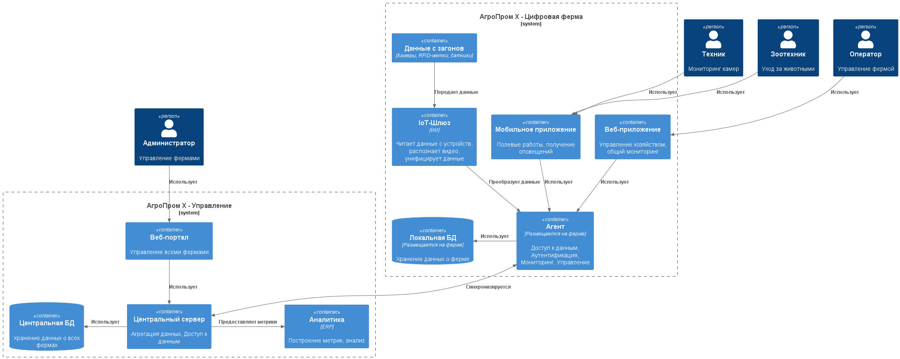
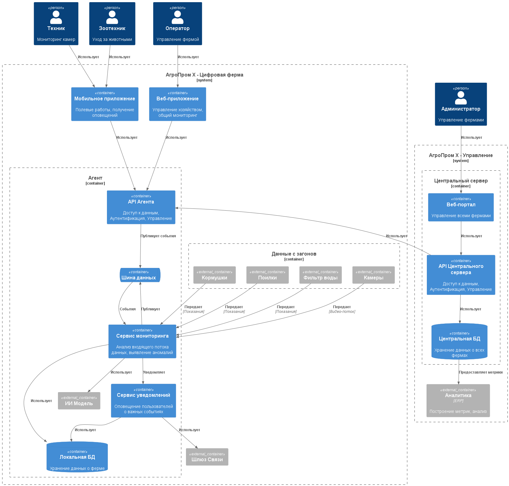

### **Название задачи:** Проработка высокоуровневого видения решений
### **Автор:** Екатерина
### **Дата:** 14.08.2025

### **Функциональные требования**

|**№**|**Действующие лица или системы**|**Use Case**|**Описание**|
| :-: | :- | :- | :- |
| **UC01** | Животные, Система мониторинга стада | Фиксация поведения стада | Необходимо распознавать и фиксировать признаки беспокойного поведения животных, драк, задавливания |
| **UC01.1** | Животные, Система мониторинга стада | Фиксация поведения стада: Драки | Необходимо распознавать и фиксировать признаки драк |
| **UC01.2** | Животные, Система мониторинга стада | Фиксация поведения стада: Задавливание | Необходимо распознавать и фиксировать признаки задавливания поросят в стаде |
| **UC02** | Животные, Система мониторинга животного | Оценка состояния индивидуальной особи | Необходимо оценивать состояние **индивидуальной** особи, выявлять: болезнь, гибель, беспокойство и т.д. (NFR07) |
| **UC02.1** | Животные, Система мониторинга животного | Оценка состояния индивидуальной особи: болезни | Необходимо выявлять болезненность животного |
| **UC02.2** | Животные, Система мониторинга животного | Оценка состояния индивидуальной особи: беспокойство | Необходимо выявлять беспокойство животного |
| **UC02.3** | Животные, Система мониторинга животного | Оценка состояния индивидуальной особи: гибель | Необходимо выявлять гибель животного |
| **UC03** | Животные, Система мониторинга стада | Подсчет поголовья | Система должна уметь подсчитывать все поголовье животных на ферме |
| **UC04** | Кормушки, Склад, Система мониторинга еды | Мониторинг еды | Необходимо отслеживать запасы еды и прогнозировать расход (NFR08) и уведомлять о снижении запасов на пульт мониторинга фермы (NFR03) |
| **UC05** | Система фильтрации воды, Система мониторинга воды | Мониторинг воды | Необходимо отслеживать состояние за системой фильтрации воды (NFR08) и уведомлять о проблемах на пульт мониторинга фермы (NFR03) |
| **UC06** | Камеры, Система мониторинга камер | Мониторинг камер | Необходимо отслеживать работоспособность камер и качество картинки (NFR08) и уведомлять о проблемах на пульт мониторинга фермы (NFR03) |
| **UC07** | Оператор, Зоотехник, Техник, Агент | Авторизация и аутентификация | Для доступа в систему необходимо иметь аккаунт сотрудника с назначенными ролями (NFR06) |
| **UC08** | Система мониторинга, Оператор, Зоотехник, Техник | Оповещать оператора о нештатных ситуациях на ферме | Уведомление о всех нештатных ситуациях на ферме должно приходить на пульт мониторинга фермы (NFR03, NFR06) |
| **UC09** | Агент | Наличие АПИ | Необходимо предоставлять универсальный АПИ для работы как Веб, так и мобильного приложений (NFR06) |
| **UC10** | Агент, Центральный сервер | Синхронизация с центральным сервером | Все данные о состоянии фермы и событиях должны быть синхронизированы с центральным сервером (NFR04, NFR05) |
| **UC11** | Центральный сервер | Метрики | Система должна поддерживать возможность предоставления и экспорта различных метрик для последующего анализа и обработки |

### **Нефункциональные требования**

|**№**|**Требование**|
| :-: | :- |
| **NFR01** | Обеспечивать **SLA >99.95%** |
| **NFR02** | Система видеоаналитики должна **реагировать в режиме реального времени** |
| **NFR03** | **Уведомления о нештатной ситуации** должны появляться **< 5 секунд** |
| **NFR04** | **Задержка между агентом и сервером** должна быть **< 10 минут** (не учитывая ситуации полного отсутствия связи с центральным сервером) |
| **NFR05** | Принцип "Сервер-Агенты", **не должно быть ограничений по количеству агентов** |
| **NFR06** | Агент должен работать **в режиме отсутствия интернета** |
| **NFR07** | Функционал системы должен расширяться без значимых изменений |
| **NFR08** | Необходимо поддерживать работы с устройствами разных производителей |

### **Решение**

Основное решение построено по принципу асинхронных микро-сервисов, которые связываются между собой с помощью общей шины данных на основе **RabbitMQ** или **Kafka**.
Синхронизация данных происходит так же с помощью асинхронного взаимодействия между сервисами синхронизации и API **на основе gRPC** протокола для обеспечения быстрой и непрерывной передачи большого потока данных.
Архитектура центральной базы данных позволяет эффективно масштабировать (как с помощью репликации, так и с помощью шардирования данных между различными серверами баз данных) всю инфраструктуру и легко поддерживать множество ферм.

**Преимущества:**
- Каждый микро-сервис соблюдает принцип единой ответственности
- Ферма и головной офис способны работать в автономном режиме, даже если связь между инфраструктурой будет нарушена
- Асинхронная система событий и операций на основе очереди позволяет обработать эти операции позже, если один из сервисов вышел из строя
- Команда разработки уже имеет опыт со схожими технологиями

**Недостатки**
- Сложное решение, состоящее из множества небольших сервисов
- Шина-данных является слабой точкой: отказ данной системы приводит к остановке межсервисного взаимодействия и регистрации/распознавания событий для уведомлений
- Все операции управления выполняются асинхронно, что может вызвать конфликты изменений, если данные будут вноситься одновременно разными пользователями.
- В момент синхронизации могут так же возникнуть конфликты данных. Например: нового сотрудника добавили вручную на ферме в систему, чтобы он получил доступ сразу же, пока отсутствовал интернет в этот день. В это же время по распоряжению аккаунт был создан и в головном управлении. Необходимо будет проработать механизм объединения данных и порядка выполнения операций.

### **Альтернативы**

**Преимущества:**
- Простое и небольшое решение, которое позволит реализовать быстрый MVP.
- Команда разработки уже имеет опыт со схожими технологиями

**Недостатки**
- Для получения данных по ферме в головном офисе, требуется, чтобы ферма была доступна. Это усложняет получения данных, а так же может создавать излишнюю нагрузку и увеличивать время загрузки данных при слабом и медленном канале связи.
- Все операции управления выполняются синхронно, в случае отсутствия интернета необходимо прорабатывать механизмы повторного выполнения запроса.

### **Недостатки, ограничения, риски**

- Коммуникация между приложением и агентским сервисом: т.к. WiFi связь слабая, необходимо рассмотреть такие варианты как Bluetooth, LoRaWan и др альтернативные каналы связи

